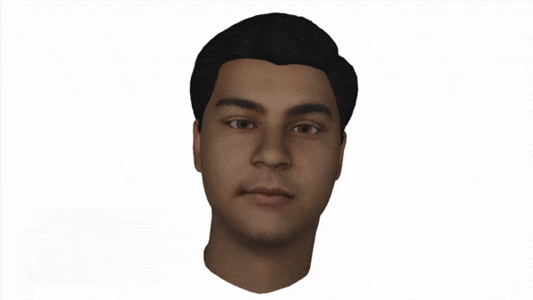

# Animoji/Memoji Clone



I've always wanted to join GVC/Zoom meetings with my Apple Animoji. Unfortunately, Apple has not made this a feature.
So I had nno choice but to take matters into my own hands. Welcome to uncanny valley.


## What is this?
Unreal Engine has an app called `Unreal Engine Live Link Face` that uses Apple's ARKit. 
Our goal is to be able to make a high-quality render of a custom Animoji, Memoji, or MetaHuman 
to a virtual webcam that can be used to join online meetings. You'll have to provide your own 3D model (for now).

## How does it work?
*TL;DR:*
```
iPhone Live Link App -> This repo -> Virtual WebCam -> Google Meet / Zoom 
```

## Installation
As of this moment, we're using my fork of PyRender until I upstream the changes.

```bash
# CLONE THIS REPO
git clone https://github.com/aelzeiny/Animoji
cd Animoji
pip install -r requirements.txt

# CLONE & Install fork of Pyrender
git clone https://github.com/aelzeiny/pyrender
cd pyrender
git checkout morph-targets
pip install -e .
cd ..
```


## Current Plans
- [x] Create 3D model of my face. I used [AvatarSDK](https://webdemo.avatarsdk.com/)'s free mesh.
- [x] Commission Apple ARKit blend-shapes.
- [x] Reverse Engineer serialization format for LiveLink App 
- [x] Render 3D avatar in PyRender
- [x] Add GLTF parsing to PyRender. [DONE](https://github.com/aelzeiny/pyrender/tree/from-gltflib)
- [x] Add Blend-Shapes to PyRender (at the level of TriMesh). [DONE](https://github.com/aelzeiny/pyrender/tree/morph-targets)
- [x] Puppet 3D model's blend-shapes with LiveLink UDP stream
- [x] Serialize framebuffer to virtual webcam

## Reverse Engineering the Unreal Engine Live Link Face App
See `Livelink UDP Structure Unpackin'.ipynb` notebook or `livelink.py` for a working example.

Apple's Face AR Kit uses Deep Learning to read your face and spit out 61 float values. Unreal Engine's Live Link Face 
App then packages those 61 float values, and dumps them to a UDP port. We can listen and record these 
bytes with netcat to create the `livelink.udp` file found in this repo.  The command is 
```bash
nc -ul 11111 > livelink.udp 2>&1
```

Fortunately for us, the Unreal Engine is open-source. So we can just peek the `AppleARKitLiveLinkSource.cpp`
file to reverse the serialization format the Unreal Engine uses.

## Apple's 52 Blend Shapes
An average AR Face Kit standardizes on [52 blendshapes](https://arkit-face-blendshapes.com/). 
We can use Blender/Maya to create a 3D avatar for ourselves, and the 52 blend-shapes needed in the 
3D model to deform the mesh to make various facial expression. These floats, clamped between [0, 1], 
define values like the amount the left eyebrow is raised, or the length  te tongue is protruded. 
I found plenty of tutorials for Blender on YouTube and services online to create these 52 
blendshapes.

## Alternatives prototyped
* Pyrender does not support blend-shapes. So I had to add that and much more to their repo.
* At first the plan was to make this a browser extension. I got this working in BabylonJS and ThreeJS out-of-the-box.
  * Unfortunately: Chrome's new ManifestV3 does not allow Canvas Rendering
  * Unfortunately: Chrome's new ManifestV3 does not allow monkey-patching in the browser.
  * [Unfortunately: The approach used in this repo](https://github.com/spite/virtual-webcam) will be impossible in 2023,
    when ManifestV2 will stop working.
* PyGame doesn't do 3D well.
* I didn't like Panda3D was a bit too much to figure out.

## Maybe Future Plans?
If I had more time I would:
- [ ] Make this more compatible with standard webcams & non-apple devices with [Google's FacePipe 468-point Mesh](https://google.github.io/mediapipe/solutions/face_mesh.html)
- [ ] Autogen face meshes with [Microsoft's Deep3dRecon API](https://github.com/sicxu/Deep3DFaceRecon_pytorch).
- [ ] Automatic blend-shapes with [Fast-n-Deep-faces](https://github.com/stephen-w-bailey/fast-n-deep-faces).
- [ ] Add voice-to-gesture synthesis with [Gesture Generation from Trimodal Context](https://github.com/ai4r/Gesture-Generation-from-Trimodal-Context)